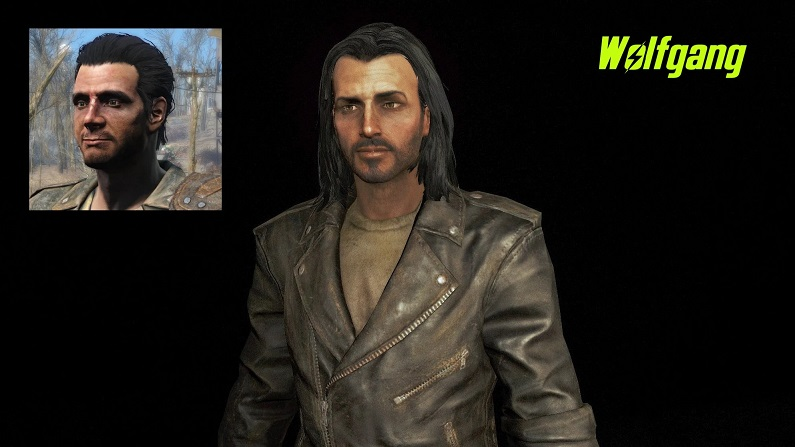
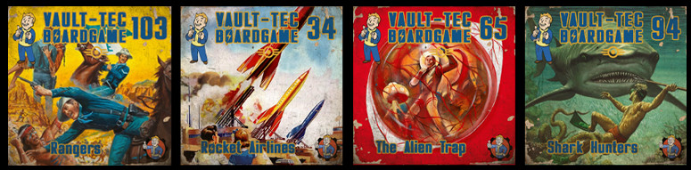
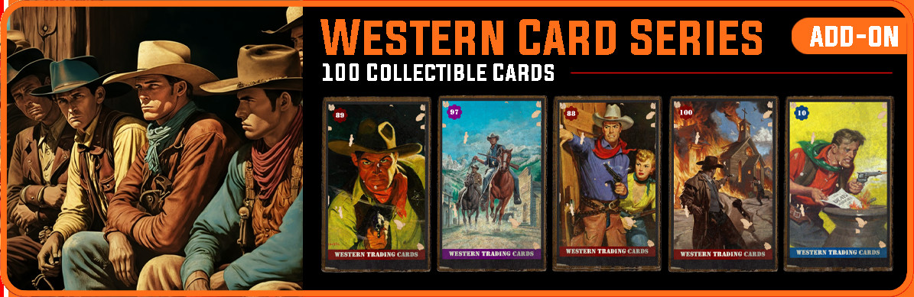
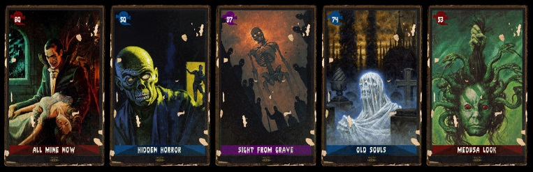

# fallout4_resurrected

My personal mod selection for Fallout 4. Requires all DLCs and ideally a Steam up-to-date fresh installation. I do not claim any copyright or ownership or involvement with any of these images, mods, or assets.

# Warnings
  - If the protagonist's voice is silent be sure to go to Steam, properties of the game and change the language to "English"! (found 5/11/23).
  - To avoid intro: open steamapps\common\Fallout 4\Data\Video\ and delete or rename the file “GameIntro_V3_B.bk2”
  - To turn on/off pip-boy flashlight: HOLD TAB!

# Essential (many mods need these)

  - [Fallout 4 Script Extender (F4SE).](https://www.nexusmods.com/fallout4/mods/42147?tab=files) (Fallout Faces & HiPoly Faces REDUX require it).
  - [Address Library for F4SE Plugins](https://www.nexusmods.com/fallout4/mods/47327?tab=files)
  - [Mod Configuration Menu](https://www.nexusmods.com/fallout4/mods/21497) (Fallout Faces & HiPoly Faces REDUX require it).
  - [MCM Booster](https://www.nexusmods.com/fallout4/mods/56997?tab=files)
  - [MCM Settings Manager](https://www.nexusmods.com/fallout4/mods/56195?tab=files)
  - [LooksMenu](https://www.nexusmods.com/fallout4/mods/12631) (Fallout Faces & HiPoly Faces REDUX require it).
  - [Looks Menu Customization Compendium](https://www.nexusmods.com/fallout4/mods/24830)
  - [Unofficial Fallout 4 Patch - UFO4P](https://www.nexusmods.com/fallout4/mods/4598)
  - [Extended Dialogue Interface](https://www.nexusmods.com/fallout4/mods/27216?tab=files)
  - [Start Me Up Redux - An Update for Alternate Start and Dialogue Overhaul.](https://www.nexusmods.com/fallout4/mods/56984)
  

# NPC's/Presets

  - [Fallout Faces (Male All-in-One and Female All-in-One](https://www.nexusmods.com/fallout4/mods/59064?tab=files), requires:
    - [CBBE](https://www.nexusmods.com/fallout4/mods/15?tab=files)
    - [HiPoly Faces REDUX (Seamless Kit - CBBE - TWB - FG - AB)](https://www.nexusmods.com/fallout4/mods/58950?tab=files)
    - [Lots More Facial Hair](https://www.nexusmods.com/fallout4/mods/10746/?tab=files)
    - [Commonwealth Cuts - KS Hairdos - ApachiiSkyHair](https://www.nexusmods.com/fallout4/mods/11402)
    - [Femshepping and radbeetle's KS Hairdos Conversions](https://www.nexusmods.com/fallout4/mods/45373?tab=files)
  

  - [Preset Face Replacers](https://www.nexusmods.com/fallout4/mods/11003?tab=files), requires:
    - [Lots More Male Hairstyles](https://www.nexusmods.com/fallout4/mods/10695?tab=files)
    - [Lots More Female Hairstyles](https://www.nexusmods.com/fallout4/mods/10543?tab=files)
- [Ponytail Hairstyles by Azar v2.5a](https://www.nexusmods.com/fallout4/mods/8126?tab=files)
- [True Reporter - Piper Outfit Redone - CBBE - Vanilla - Bodyslide](https://www.nexusmods.com/fallout4/mods/11611?tab=files)

# Companions
  - [Buttons.](https://www.nexusmods.com/fallout4/mods/31710)
    
    
  - [Other companion](https://www.nexusmods.com/fallout4/mods/31710)

# Weather and landscape
  - [Misty Pines Overhaul](https://www.nexusmods.com/fallout4/mods/28990?tab=files)
  - [True Storms](https://www.nexusmods.com/fallout4/mods/4472?tab=files)
  - [Vivid Weathers](https://www.nexusmods.com/fallout4/mods/15466?tab=files)
  - [Better LOD](https://www.nexusmods.com/fallout4/mods/40417?tab=files)
  - [Better Rubble](https://www.nexusmods.com/fallout4/mods/36301?tab=files)
    - [True Grass](https://www.nexusmods.com/fallout4/mods/23469?tab=files)

# Collectibles
  - [Book Collector - Philosophy for the Wasteland.](https://www.nexusmods.com/fallout4/mods/72568) (This treasure hunt adds 40 classic works of western philosophy.ESP marked as ESL.)
    
    
  - [Teddies 76](https://www.nexusmods.com/fallout4/mods/57424)

# Ketaros Collectibles
  - [Ketaros Framework.](https://www.nexusmods.com/fallout4/mods/68236) (needed for all his add-ons).
  - [ADD-ON - Pin-Up Card Series.](https://www.nexusmods.com/fallout4/mods/68239) (100 collectible cards).
    
    
  - [ADD-ON - Board Games Collection Series.](https://www.nexusmods.com/fallout4/mods/68268) (120 collectible board games).
    
    
  - [ADD-ON - Western Card Series.](https://www.nexusmods.com/fallout4/mods/68241) (100 collectible cards).
    
    
  - [ADD-ON - Terror Card Series.](https://www.nexusmods.com/fallout4/mods/68244) (100 collectible cards).
    
    

# Quality of life
  - [HoloGlow - A glowing holotape mod.](https://www.nexusmods.com/fallout4/mods/59901?tab=files)
    
    

# Lighting  
  - [Ultra Interior Lighting.](https://www.nexusmods.com/fallout4/mods/22101)

# Immersion
  - [Lowered Weapons](https://www.nexusmods.com/fallout4/mods/522?tab=files)
  - [Increases Movement Speed](https://www.nexusmods.com/fallout4/mods/21807?tab=files)
  - [Lootable Cars - Exiguous](https://www.nexusmods.com/fallout4/mods/63025?tab=files)
  - [Pip-Boy Flashlight](https://www.nexusmods.com/fallout4/mods/10840/?tab=bugs)

# Quests
  - [No Case Unsolved - More Valentine Case Files.](https://www.nexusmods.com/fallout4/mods/58654) (Adds 12 new case files to Nick Valentine's).

# Buildings / area expansions
  - [The Beantown Interiors Project](https://www.nexusmods.com/fallout4/mods/4612?tab=files)
  - [Phase 4 An Institute Expansion.](https://www.nexusmods.com/fallout4/mods/42647?tab=files)
  - [South of The Sea. (Massive GS and more Expansion) (Final Update July 2020).](https://www.nexusmods.com/fallout4/mods/27870) (WARNING: "Youll still need the AWKCR patch if you still use that old mod.").

# Homes
  - [Army Bunker player home and settlement. (Elianora)](https://www.nexusmods.com/fallout4/mods/62209)
    
    

# Locations
  - [Immersive Drumlin Diner](https://www.nexusmods.com/fallout4/mods/18995)

# Audio
  - [Aggressive synth voice overhaul.](https://www.nexusmods.com/fallout4/mods/2105)
  - [Cough.](https://www.nexusmods.com/fallout4/mods/49235)

# Fixes
  - [Ownership Fixes](https://www.nexusmods.com/fallout4/mods/56885)
  - [Radio Reverb Fix](https://www.nexusmods.com/fallout4/mods/16563?tab=files)
  - [River Fix](https://www.nexusmods.com/fallout4/mods/36762?tab=files) (choose the ESL to avoid counting towards the mod limit).
  - [Fixed Gobo Effects](https://www.nexusmods.com/fallout4/mods/27445)
  - [Long Save Bug Fix](https://www.nexusmods.com/fallout4/mods/68681)
  - [Fallout 4 Fixes](https://www.nexusmods.com/fallout4/mods/63005)
  - [Mesh Bounds Fix](https://www.nexusmods.com/fallout4/mods/70817?tab=files)
  - [Interior NavCut Fix](https://www.nexusmods.com/fallout4/mods/72904?tab=files)
  - [Water LOD Fix](https://www.nexusmods.com/fallout4/mods/33815)
  
  - [Elevator Buttons Fix (Contraptions)](https://www.nexusmods.com/fallout4/mods/20664)
  - [NPC Drinking Fix](https://www.nexusmods.com/fallout4/mods/53980)
  - [Fixed Alpha Maps](https://www.nexusmods.com/fallout4/mods/28974?tab=files)
  - [High Res DLC Black Face Fix](https://www.nexusmods.com/fallout4/mods/21907)
  - [High FPS Physics Fix](https://www.nexusmods.com/fallout4/mods/44798)

# Textures
  - [Vivid Fallout - All in One](https://www.nexusmods.com/fallout4/mods/25714/?tab=files)
  - [Vivid Fallout - LOD and Far Distant Detail](https://www.nexusmods.com/fallout4/mods/71745)

# Clothing/Armor
  - [Proto Vault Suit](https://www.nexusmods.com/fallout4/mods/2187)
  - [More Clothes and Textures (CBBE)](https://www.nexusmods.com/fallout4/mods/40315?tab=files)

# Gore and blood
  - [Enhanced Blood Textures.](https://www.nexusmods.com/fallout4/mods/212/)
  - [Gore Overhaul 3.0 -Reload-](https://www.nexusmods.com/fallout4/mods/21216?tab=files)

# Main Menu
  - [Post Apocalypse Main Menu](https://www.nexusmods.com/fallout4/mods/74231?tab=files)

# Expansions
  - [Caves Of The Commonwealth](https://www.nexusmods.com/fallout4/mods/75647)
  - 

# GUI
  - [HUDFramework](https://www.nexusmods.com/fallout4/mods/20309)
  - [FallUI - HUD](https://www.nexusmods.com/fallout4/mods/51813)
  - [Nameplates - Floating Healthbars](https://www.nexusmods.com/fallout4/mods/21636?tab=files)

# Creatures
  - [Fog Crawlers Of The Commonwealth](https://www.nexusmods.com/fallout4/mods/55698?tab=files)

# Bobbleheads
  - [New Vault-Girl Bobbleheads AIO.](https://www.nexusmods.com/fallout4/mods/60833) ( [NSFW version here.](https://www.nexusmods.com/fallout4/mods/63047) )
    
    

