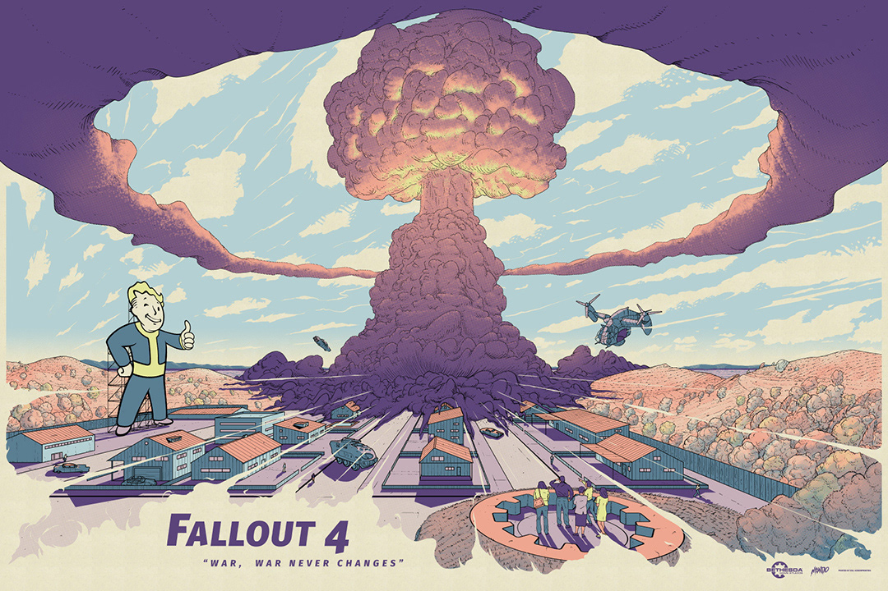

# fallout4_resurrected



My personal mod selection for Fallout 4. Requires all DLCs and ideally a Steam up-to-date fresh installation. I do not claim any copyright or ownership or involvement with any of these images, mods, or assets.

# Warnings / Remembers

| Problem | Solution |
|----------|----------|
| The protagonist's voice is silent when looking into the mirror at the start of the game! | Be sure to go to Steam, properties of the game and change the language to "English"! (found 5/11/23). Happened to me because Steam detected my language as Spanish and didn't care to install the English language files. |
| I want to avoid the Bethesda logo intro. | Open steamapps\common\Fallout 4\Data\Video\ and delete or rename the file “GameIntro_V3_B.bk2” |
| I don't remember how to turn on/off the pip-boy flashlight. | **HOLD** tab key! |
| I need to remove Piper's Hat because it's clipping with her hair. | Console ("ñ" key in Spanish keyboard, the key left to 1 in English keyboard) and write "2f1f.unequipItem a81af" and then "2f1f.removeItem a81af" |
| I don't remember how to activate the V.A.T.S. in combat. | Use the Q key. |
| I don't remember how to throw a grenade or Molotov cocktail | Select it in the Pipboy, and hold TAB in combat to throw it. |
| I don't remember how to sheath or draw my gun. | Hold the R key. |
| [REMEMBER HOW TO HACK TERMINALS!](https://www.thegamer.com/fallout-4-guide-terminal-passwords-hacking/) | **It's VERY important to click on { [ ( etc (that highlight several characters) to remove words or reset attempts!** (it says "Dud" removed and removes a possible key). |

# Essential (many mods need these)

| Mod | Brief summary | Spanish translation |
|----------|----------|----------|
| [Fallout 4 Script Extender (F4SE).](https://www.nexusmods.com/fallout4/mods/42147) | (Fallout Faces & HiPoly Faces REDUX require it). A lot of mods require F4SE, it's essential. | Not needed. |
| [Address Library for F4SE Plugins.](https://www.nexusmods.com/fallout4/mods/47327) | ``` TODO. TO BE DONE 🚧 ``` | Not needed. |
| [Mod Configuration Menu.](https://www.nexusmods.com/fallout4/mods/21497) | (Fallout Faces & HiPoly Faces REDUX require it). Let you configure your mods via ESC menu | todo |
| [MCM Booster.](https://www.nexusmods.com/fallout4/mods/56997) | Makes MCM go faster using some black magic. | Not needed. |
| [MCM Settings Manager.](https://www.nexusmods.com/fallout4/mods/56195) | ``` TODO. TO BE DONE 🚧 ``` | todo |
| [LooksMenu.](https://www.nexusmods.com/fallout4/mods/12631) | (Fallout Faces & HiPoly Faces REDUX require it). A lot of mods require it for improved characters. | todo |
| [Looks Menu Customization Compendium.](https://www.nexusmods.com/fallout4/mods/24830) | ``` TODO. TO BE DONE 🚧 ``` | todo |
| [Unofficial Fallout 4 Patch - UFO4P.](https://www.nexusmods.com/fallout4/mods/4598) | ``` TODO. TO BE DONE 🚧 ``` | todo |
| [Extended Dialogue Interface.](https://www.nexusmods.com/fallout4/mods/27216) | Easier conversation. | todo |
| [Start Me Up Redux - An Update for Alternate Start and Dialogue Overhaul.](https://www.nexusmods.com/fallout4/mods/56984). | Alternative starting. Not doing the same playthrough (and initial long cutscene) every time. | todo |
| [Lighthouse Papyrus Extender.](https://www.nexusmods.com/fallout4/mods/71420) | Required by some mods. | Not needed. |

# Fix/fixes

| [Load Accelerator.](https://www.nexusmods.com/fallout4/mods/10283) | Reduce the loading time by controlling vsync(fps) and CPU affinity at loading screen. This is expected to shorten the loading time under the SSD environment. (Under an HDD environment does not seem to have much effect) | Not needed. |
| [Long Loading Times Fix.](https://www.nexusmods.com/fallout4/mods/73469) | F4SE plugin to fix long loading times. Also some settings for loading screens. | todo (Russian translation is available). |

# Immersion

| Mod | Brief summary | Spanish translation |
|----------|----------|----------|
| [Lowered Weapons](https://www.nexusmods.com/fallout4/mods/522) | ``` TODO. TO BE DONE 🚧 ``` | ``` TODO. TO BE DONE 🚧 ``` |
| [Third-Person Movement Speed Fix](https://www.nexusmods.com/fallout4/mods/28737) | ``` TODO. TO BE DONE 🚧 ``` | ``` TODO. TO BE DONE 🚧 ``` |
| [Lootable Cars - Exiguous](https://www.nexusmods.com/fallout4/mods/63025) | ``` TODO. TO BE DONE 🚧 ``` | ``` TODO. TO BE DONE 🚧 ``` |
| [Pip-Boy Flashlight](https://www.nexusmods.com/fallout4/mods/10840) | ``` TODO. TO BE DONE 🚧 ``` | ``` TODO. TO BE DONE 🚧 ``` |
| [Achievements.](https://www.nexusmods.com/fallout4/mods/12465) | ``` TODO. TO BE DONE 🚧 ``` | ``` TODO. TO BE DONE 🚧 ``` |
| [Immersive Vendors](https://www.nexusmods.com/fallout4/mods/10039) | ([Review here.](https://www.youtube.com/watch?v=hiXwhQ13Nm0)). |  [Immersive Vendors - Spanish Translation.](https://www.nexusmods.com/fallout4/mods/35759) |
| [NPCs Travel.](https://www.nexusmods.com/fallout4/mods/16987) | ``` TODO. TO BE DONE 🚧 ``` | ``` TODO. TO BE DONE 🚧 ``` |
| [Splinterz - Breakable Wooden Doors](https://www.nexusmods.com/fallout4/mods/21521) | ``` TODO. TO BE DONE 🚧 ``` | ``` TODO. TO BE DONE 🚧 ``` |
| [Backpacks of the Commonwealth.](https://www.nexusmods.com/fallout4/mods/29447) | ``` TODO. TO BE DONE 🚧 ``` | ``` TODO. TO BE DONE 🚧 ``` |
| [KCI - Kellogg's Cybernetic Implants.](https://www.nexusmods.com/fallout4/mods/48812) | :tv: [Reviewed here (amongst other mods) by MxR.](https://www.youtube.com/watch?v=1JqPQvw_8xA) | ``` TODO. TO BE DONE 🚧 ``` |
| [Player Curses During Lockpicking and Hacking. ESL.](https://www.nexusmods.com/fallout4/mods/48771) **PICK THE ESL VERSION!**| When you break a Bobby Pin, choose the wrong password during hacking, or just get locked out of a Terminal you may mutter some "indecent" words... Well.. this mod makes them audible in the Game too. | todo with xVaSynth2? |
| [Notes of The Commonwealth.](https://www.nexusmods.com/fallout4/mods/44532) | Adds a variety of lore-friendly notes to various locations in the game. Some funny, mundane, sad, scary, and lots more. | ``` TODO. TO BE DONE 🚧 ``` |
| [Shatter - Shardz and Spillz.](https://www.nexusmods.com/fallout4/mods/33280) | The files in this package make many glass, ceramic, and other things destructible! | Needed? Maybe rename some things as destructible Skyrim did. Jaume |
| [More Realistic Fire Behavior.](https://www.nexusmods.com/fallout4/mods/30246) | This mod simply makes it so that when NPCs have 100% of their skin engulfed in flames they care a little. | todo |
| [Military MREs - Meal Ready to Eat - New Food.](https://www.nexusmods.com/fallout4/mods/25824) | Pre-war MREs in 14 flavors featuring brand-new meshes and textures. Supply caches at military bases, and injected into vendor lists. | todo (french translation already is done). |
| [Merchants Sells Weapon Mods.](https://www.nexusmods.com/fallout4/mods/39065) | Adds weapon mods to weapon vendors inventories. | todo |
| [Mercenaries and safe passage.](https://www.nexusmods.com/fallout4/mods/31802) | Adds Three New NPCs to the game, which can be hired to fight alongside the player temporarily. Some provide safe passage among dangerous factions they are associated with. | todo |
| [Garmin Foretrex 901.](https://www.nexusmods.com/fallout4/mods/76214) | Adds the Garmin Foretrex 901 watch to the game. The watch displays several things like World Time, Current Ammo, Detection state, Cripple conditions and much more. :tv: [Review here.](https://www.youtube.com/watch?v=UxpDAt8y9Gg) | todo |

# Weapons

| Mod | Brief summary | Spanish translation |
|----------|----------|----------|
| [Heckler und Koch - G36 Complex.](https://www.nexusmods.com/fallout4/mods/64108) | This mod adds a G36 into Fallout 4. It features custom animations, sounds, and a quest. | ``` TODO. TO BE DONE 🚧 ``` |
| [More Uniques - Unique Weapons Expansion.](https://www.nexusmods.com/fallout4/mods/18357) | ``` TODO. TO BE DONE 🚧 ``` | ``` TODO. TO BE DONE 🚧 ``` |
| [All Weapons HD (A.W.H.D.).](https://www.nexusmods.com/fallout4/mods/8556) | 4K upscale of every weapon in the game 0.o Yup you heard right, Every single one! | ``` TODO. TO BE DONE 🚧 ``` |
| [Remove Ammo from Dropped Guns.](https://www.nexusmods.com/fallout4/mods/64426) | ``` TODO. TO BE DONE 🚧 ``` | ``` TODO. TO BE DONE 🚧 ``` |
| [Better Ammo Boxes.](https://www.nexusmods.com/fallout4/mods/8087) | ``` TODO. TO BE DONE 🚧 ``` | ``` TODO. TO BE DONE 🚧 ``` |
| [Automatron Expanded Weapons System.](https://www.nexusmods.com/fallout4/mods/29858) | ``` TODO. TO BE DONE 🚧 ``` | ``` TODO. TO BE DONE 🚧 ``` |
| [Remote Explosives - C4 with Detonators and More.](https://www.nexusmods.com/fallout4/mods/22444) |Adds familiar C-4 and three other new explosive types with new meshes, and a working remote detonator with new animations, giving you you the ability to make explosives more tactical or blow up your enemy's pants from afar! | [Remote Explosives - C4 with Detonators and More - Spanish Translation.](https://www.nexusmods.com/fallout4/mods/29315) |
| [M84 FlashBang.](https://www.nexusmods.com/fallout4/mods/56981) | The FlashBang can blind and paralyze more than 20 creatures in the game. | ``` TODO. TO BE DONE 🚧 ``` |
| [Bullpup Bozar.](https://www.nexusmods.com/fallout4/mods/28478) | This mod will add Bozar - a legendary sniper LMG from Fallout 2 and Fallout New Vegas GRA DLC, with new bullpup design, custom assets and animations. | todo |
| [MW2023 - Katt-AMR.](https://www.nexusmods.com/fallout4/mods/76201) | Adds the Katt-AMR from MW3 (2023) into Fallout 4. Requires "See Through Scopes, see below". | todo |
| [See Through Scopes.](https://www.nexusmods.com/fallout4/mods/9476) | Adds see-through (so no scope overlay) Combat Scopes to various weapons. | [See Through Scopes -Spanish-](https://www.nexusmods.com/fallout4/mods/53858) |

# DLC sized expansions

| Mod | Brief summary | Spanish translation |
|----------|----------|----------|
| [America Rising 2 - Legacy of the Enclave](https://www.nexusmods.com/fallout4/mods/75767) | Remaster of the 1. Review by JuiceHead. | todo |
| [Outcasts and Remnants - Quest Mod Plus](https://www.nexusmods.com/fallout4/mods/21469) | DLC-sized quest mod. 20 hours of gameplay with new factions, locations, player bases, and fully-voiced custom companions. | todo |
| [Depravity](https://www.nexusmods.com/fallout4/mods/35513) | Large quest/companion mod with evil RPG options for the vanilla main story. 40 quests, 13 companions, and around 20 hours of content. Requires Outcasts and Remnants. | todo |
| [The Machine And Her.](https://www.nexusmods.com/fallout4/mods/30488) | DLC-sized quest featuring 4-5 hours of gameplay, fully voiced companion with custom affinity, new radio station, and a story that reacts to your choices! September 2019 Mod Of The Month! | todo |
| [Fallout 4 Northern Springs DLC.](https://www.nexusmods.com/fallout4/mods/32911) | Northern Springs is a massive DLC that adds a new location larger than Nuka World and Far Harbor. It is an enormous land to explore with new quests, new weapons, new armor, settlements, and much more to find. A true DLC that naturally expands & adds beyond the Commonwealth further to the North. | todo |
| [Fallout Sakhalin.](https://www.nexusmods.com/fallout4/mods/34945) | A new island, new interiors, new quests, factions, monsters, etc. | todo |
| [Project Zeta.](https://www.nexusmods.com/fallout4/mods/60267) | Project based on Mothership Zeta and Invaders from Beyond. Adds a load of new workshop constructibles, 3 New weapons (3 uniques as well), 1 new outfit, one new companion, two new enemy types as well as two new workshops. | [Project Zeta VER. Spanish.](https://www.nexusmods.com/fallout4/mods/67137) |
| [Project Zeta Fixes.](https://www.nexusmods.com/fallout4/mods/65166) | todo | todo |
| [Project Zeta Expanded.](https://www.nexusmods.com/fallout4/mods/72133) | Makes Project Zeta feel less empty while fixing a couple of bugs. | todo |

# Locations

| Mod | Brief summary | Spanish translation |
|----------|----------|----------|
| [Immersive Drumlin Diner.](https://www.nexusmods.com/fallout4/mods/18995) | todo | todo |
| [Starlight Drive-In Overhaul.](https://www.nexusmods.com/fallout4/mods/12763) | A small mod to repair the Starlight Drive-In. The parking is repaired and the pond was moved. That's it really. | todo |
| [The Depths Below.](https://www.nexusmods.com/fallout4/mods/19301) | Settlers at Hangman's Alley are being attacked, and it's up to you to put a stop to it. But things are not what they appear to be! Discover the mysterious train station, and unravel the mystery of The Depths Below. | todo |

# Animations

| Mod | Brief summary | Spanish translation |
|----------|----------|----------|
| [No Crafting Animations.](https://www.nexusmods.com/fallout4/mods/63183) | ``` TODO. TO BE DONE 🚧 ``` | Not needed. |
| [No Door Animations - Instant Doors.](https://www.nexusmods.com/fallout4/mods/63224) | ``` TODO. TO BE DONE 🚧 ``` | Not needed. |
| [Realistic Death Physics - No Animations.](https://www.nexusmods.com/fallout4/mods/4371) | ``` TODO. TO BE DONE 🚧 ``` | Not needed. |
| [Combat Knife Animations.](https://www.nexusmods.com/fallout4/mods/75952) | ``` TODO. TO BE DONE 🚧 ``` | Not needed. |
| [Another Deliverer Reanimation.](https://www.nexusmods.com/fallout4/mods/76195) | Deliverer is a type of gun in the game. Imatge a github. Uses this textures: [VWR - Vanilla Weapons Redone.](https://www.nexusmods.com/fallout4/mods/47726) | Not needed. |
| [Better Female Walk (Extra Jiggle).](https://www.nexusmods.com/fallout4/mods/21370) | :tv: [Better Female Walk reviewed here by MxR](https://www.youtube.com/watch?v=9tdoqLwnqCM) | Not needed. |
| [Assault Rifle Reanimated.](https://www.nexusmods.com/fallout4/mods/61012) | Needs [Tactical Reload](https://www.nexusmods.com/fallout4/mods/49444) | Not needed. |

# Buildings

| Mod | Brief summary | Spanish translation |
|----------|----------|----------|
| [The British Consulate General.](https://www.nexusmods.com/fallout4/mods/19486) | todo | todo |
| [The Lost Building of Atlantic.](https://www.nexusmods.com/fallout4/mods/25401) | As you're wandering through the ruins of downtown Boston, you find a building that is heavily fortified by a camp of raiders. You're not about to let a bunch of raiders get in the way of your curiosity, so you blast through them and enter the building. Inside, you can learn the story of Allison Miller, the CEO of Atlantic Pharmaceuticals. | todo |
| [Bioshock Infinite Lighthouse.](https://www.nexusmods.com/fallout4/mods/23881) | Bioshock Infinite Light House, right behind the Atom Cats Garage. Can be used as a player home | todo |
| [Pipboy Games Store.](https://www.nexusmods.com/fallout4/mods/16895) | This place was the location people used to buy games for Pipboy Machine. | todo |

# Radio

| Mod | Brief summary | Spanish translation |
|----------|----------|----------|
| [Game Show Radio.](https://www.nexusmods.com/fallout4/mods/27759) | A radio station with 160+ episodes of your favorite quiz shows from the '40s, '50s and '60s. | Not needed. |
| [Old Wold Radio](https://www.nexusmods.com/fallout4/mods/9048) | 29 new stations, custom craftable settlement radios for each station, craftable holotapes for each station for in-game volume control and track-seeking control, craftable posters and billboards included, compatibility patches included. | Not needed. |
| [Detour Radio.](https://www.nexusmods.com/fallout4/mods/29060) | Over 110 songs from the golden age of music. All lore-friendly. This is just continuous music with no DJ or commercials added. A craftable radio is available in the workshop so your settlers can enjoy it as well. XBOX and PC versions are also available at Bethesda's site. | Not needed. |
| [Delta Wasteland Radio - Now with 70-plus old blues tunes.](https://www.nexusmods.com/fallout4/mods/11087) | Radio station adds 36 classic blues songs from the 1920s-1930s | Not needed. |
| [Starlight Drive-In Trailer Radio](https://www.nexusmods.com/fallout4/mods/29305). |This mods ads a new radio station to the Commonwealth that you can listen to on your Pip-Boy. The radio station features many trailers from old-school movies, such as The Mummy (1932), The Wizard of Oz (1939) and 12 Angry Men (1957). In total, there are 20 different trailers for old movies, with a few commercials and announcements in between. | Not needed. |
| [The Cat's Meow -Atom Cats Radio-.](https://www.nexusmods.com/fallout4/mods/34288) | This mod adds a brand new lore-friendly radio station called "The Cat's Meow" which is hosted by Rowdy of the Atom Cats. It also comes with a craftable holotape which allows the user to change tracks and to raise/lower the volume of the station. | Not needed. |

# Fixes

| Mod | Summary |
|----------|----------|
| [Ownership Fixes.](https://www.nexusmods.com/fallout4/mods/56885) | ``` TODO. TO BE DONE 🚧 ``` |
| [Radio Reverb Fix.](https://www.nexusmods.com/fallout4/mods/16563) | ``` TODO. TO BE DONE 🚧 ``` |
| [River Fix](https://www.nexusmods.com/fallout4/mods/36762) | (choose the ESL to avoid counting towards the mod limit). |
| [Fixed Gobo Effects](https://www.nexusmods.com/fallout4/mods/27445) | ``` TODO. TO BE DONE 🚧 ``` |
| [Long Save Bug Fix](https://www.nexusmods.com/fallout4/mods/68681) | ``` TODO. TO BE DONE 🚧 ``` |
| [Fallout 4 Fixes](https://www.nexusmods.com/fallout4/mods/63005) | ``` TODO. TO BE DONE 🚧 ``` |
| [Mesh Bounds Fix](https://www.nexusmods.com/fallout4/mods/70817) | ``` TODO. TO BE DONE 🚧 ``` |
| [Interior NavCut Fix](https://www.nexusmods.com/fallout4/mods/72904) | Fixes disappearing buildings at random times. |
| [Water LOD Fix](https://www.nexusmods.com/fallout4/mods/33815) | Makes water look prettier from the distance. |
| [Elevator Buttons Fix (Contraptions)](https://www.nexusmods.com/fallout4/mods/20664) | A fix in the buttons of a certain elevator. |
| [NPC Drinking Fix](https://www.nexusmods.com/fallout4/mods/53980) | ``` TODO. TO BE DONE 🚧 ``` |
| [Fixed Alpha Maps](https://www.nexusmods.com/fallout4/mods/28974) | Fixes some vanilla not working transparencies. | 
| [High Res DLC Black Face Fix](https://www.nexusmods.com/fallout4/mods/21907) | Fixes an annoying bug where some pale character has the dark face but not the body, after loading a game. Happens in Skyrim too. |
| [Diamond City Auto Close Gate](https://www.nexusmods.com/fallout4/mods/12928) | Fixes lore/consistency bug. |
| [Long Loading Times Fix](https://www.nexusmods.com/fallout4/mods/73469?tab=files) | ``` TODO. TO BE DONE 🚧 ``` |
| [Remove Helmet In Dialog](https://www.nexusmods.com/fallout4/mods/24480/) | I want to see my characters face when talking! Not his/her helmet! This automatically fixes it. |
| [Vault 88 Crash Fix - Remove Molerats and Radscorps](https://www.nexusmods.com/fallout4/mods/73601) | ``` TODO. TO BE DONE 🚧 ``` |
| [Shadow Boost FO4](https://www.nexusmods.com/fallout4/mods/63482) | (Sets the distance of the shadows dynamically with F4SE). [check out this review by JuiceHead](https://www.youtube.com/watch?v=RdIzlBABMSY). |
| [High FPS Physics Fix.](https://www.nexusmods.com/fallout4/mods/44798) | Untie the game speed from the framerate. Fixes physical bugs. Reduces loading time. |
| [XDI - America Rising 2 (AR2) Patch](https://www.nexusmods.com/fallout4/mods/76204) | This patches America Rising 2 to work with Extended Dialogue Interface (XDI). |
| [Mutilated Dead Bodies crash fix.](https://www.nexusmods.com/fallout4/mods/76206) | ``` TODO. TO BE DONE 🚧 ``` |
| [Corpse Collision.](https://www.nexusmods.com/fallout4/mods/37133) | Run into dead things and they get pushed. |

# Creatures / Monsters

| Mod | Brief summary | Spanish translation |
|----------|----------|----------|
| [Fog Crawlers Of The Commonwealth.](https://www.nexusmods.com/fallout4/mods/55698) | todo | todo |
| [Institute Centaurs.](https://www.nexusmods.com/fallout4/mods/41476) | todo screenshot | todo |
| [Mutant Menagerie - Life Finds A Way.](https://www.nexusmods.com/fallout4/mods/68187) | :tv [Review here](https://www.youtube.com/watch?v=RdIzlBABMSY) | todo |
| [Respawnable Legendary Bosses and Hard Legendary Giant Creatures](https://www.nexusmods.com/fallout4/mods/10124) | todo | todo |
| [Mirelurk Queen Variants.](https://www.nexusmods.com/fallout4/mods/13333) | todo | todo |

PUT SCREENSHOTS

# Settlements

| Mod | Brief summary | Spanish translation |
|----------|----------|----------|
| [Settlement Menu Manager.](https://www.nexusmods.com/fallout4/mods/24204) | ``` TODO. TO BE DONE 🚧 ``` | todo |
| [Dino's Decorations - clutter arrangements for your settlements.](https://www.nexusmods.com/fallout4/mods/16186) | Make your settlements look a little more lived in, requires: [Place Everywhere](https://www.nexusmods.com/fallout4/mods/9424) | todo |
| [Snappable Clutter and Display.](https://www.nexusmods.com/fallout4/mods/69980) | Adds modular clutter that will snap to provided furniture, giving you limitless combinations to add clutter to your settlements. | todo |
| [Sandbag Fortifications.](https://www.nexusmods.com/fallout4/mods/21358) | ``` TODO. TO BE DONE 🚧 ``` | todo |
| [Settlement Keywords Expanded.](https://www.nexusmods.com/fallout4/mods/12226) | Needed by some mods. | todo |
| [Objects for Bathroom and Kitchen - WorkshopPack.](https://www.nexusmods.com/fallout4/mods/38515) | Adds washing machine & dryer + some more objects for your bathroom. | todo |
| [Minutemen Propaganda Posters.](https://www.nexusmods.com/fallout4/mods/11975) | ``` TODO. TO BE DONE 🚧 ``` | todo |
| [Nothing Fancy Hot Showers.](https://www.nexusmods.com/fallout4/mods/46241) | Adds 4 showers and some color variants, showers work like a decontamination arch. Requires DLC: Wasteland Workshop. | todo |
| [Showers ESL.](https://www.nexusmods.com/fallout4/mods/36107) | ix showers that boost your charisma or remove your rads. | todo |

# Nuka World

| Mod | Brief summary | Spanish translation |
|----------|----------|----------|
| [Nukatown Market - Reborn.](https://www.nexusmods.com/fallout4/mods/24057) | A new expansion of the Nukatown market from the Nukaworld DLC. | todo |
| [No Quest Autostart - Nuka World.](https://www.nexusmods.com/fallout4/mods/31433) | Prevents the Nuka-World main quest from running without either visiting the Nuka-World Transit Station or listening to the radio station. | Not needed. |

# Quests

| Mod | Brief summary | Spanish translation |
|----------|----------|----------|
| [No Case Unsolved - More Valentine Case Files.](https://www.nexusmods.com/fallout4/mods/58654) | Adds 12 new case files to Nick Valentine's detective office in Diamond City. | todo |
| [Atomic Radio and Tales from the Commonwealth.](https://www.nexusmods.com/fallout4/mods/8704) | Be sure to download **BOTH.** | todo |
| [Mad Rock - Quest - Settlement](https://www.nexusmods.com/fallout4/mods/32146) | Brutal, near Billy the Boy in the fridge. | todo |
| [Maxwell's World.](https://www.nexusmods.com/fallout4/mods/18949) | A DLC-sized, haunted amusement park quest mod. Fully voiced acted, with new weapons like the heavy incinerator and fireworks cannon, monsters, multiple endings, new companions, and much much more! | :tv: [Maxwell's World reviewed by MxR here.](https://www.youtube.com/watch?v=ikcZwv6BUuw) |
| [CSEP Presents Commonwealth Killer - Quest Mod.](https://www.nexusmods.com/fallout4/mods/61305) | ``` TODO. TO BE DONE 🚧 ``` | todo |
| [Submarine Base Echo Dungeon and Quest.](https://www.nexusmods.com/fallout4/mods/14471) | Quest about finding an item for Dr. Waters. A new Dungeon level 30a40 + with some loot at the end. | todo |
| [No Quest Autostart - Automatron.](https://www.nexusmods.com/fallout4/mods/31576) | Prevents the Automatron main quest from automatically starting until the player listens to the Caravan Distress Call. | todo |
| [The Kelly Manor Horror - Quest.](https://www.nexusmods.com/fallout4/mods/27657) | A spooky horror quest mod. | todo |
| [50 Ways to Die at Dr. Nick's - Quest Mod.](https://www.nexusmods.com/fallout4/mods/25564) | 10 Connected Quests, Unique Rewards, Custom Player Home, Lore-Friendly Backstory, Lots of Explosions, and a Twist. | todo |
| [Main Quest Choices Extended.](https://www.nexusmods.com/fallout4/mods/19835) | A few changes that expand your options in the main story including keeping the Railroad alive. | todo |
| [Whose Quest Is It Anyway.](https://www.nexusmods.com/fallout4/mods/51979) | Swap the "quest items can't be removed" message with something a little more informative. | todo |
| [No Quest Autostart - Far Harbor.](https://www.nexusmods.com/fallout4/mods/31450) | Prevents "Far From Home" from starting without the player either listening to Ellie's radio message or visiting the Nakano residence." | todo |
| [CHAOTIC SUN.](https://www.nexusmods.com/fallout4/mods/38808) 2.9GB!!!| "It starts with a Nameless Island and is an adventure focused on combat and exploration. The dungeon that accumulates a person's memory. powerful Temple Knights and their Synth Army. Stalkers seem to have gathered after hearing the rumor of treasure. You fight with the help of a 3D-printed spirit called Wraith, and the Android. Let's get started!" | todo |
| [Enter The Brotherhood.](https://www.nexusmods.com/fallout4/mods/28006) | Fixes the BoS quest line so that in order to get them in the Commonwealth, you have to help Danse and his team. | todo |
| [Introducing - Radium-Inc.](https://www.nexusmods.com/fallout4/mods/32175) | A dungeon mod with a small questline, this mod takes the player through the headquarters of Radium-Inc., a company that made radium-infused products. | todo |
| [String Theory.](https://www.nexusmods.com/fallout4/mods/33148) | What begins as a normal morning by Commonwealth standards soon unravels into strangeness when you stop by your local Sanctuary Diner. A young man needs a favour, a young girl has a one of a kind key and an important story needs to be told. This mod contains three new locations and two quests. **Note - This mod doesn't have voice acting.** | todo |

posar imatges github

# Armor / armors (not clothes)

| Mod | Brief summary | Spanish translation |
|----------|----------|----------|
| [Chinese Stealth Suit.](https://www.nexusmods.com/fallout4/mods/20959) | :tv: [Reviewed here by MxR.](https://www.youtube.com/watch?v=9tdoqLwnqCM) | todo |
| [NCR Outfit Pack.](https://www.nexusmods.com/fallout4/mods/58182) | Adds in loads of new NCR outfits from Fallout New Vegas and its DLCs, these can be found at vendors like Fallon's basement. You can buy both the armours and plans to craft them a the chemistry workbench. | todo |
| [CROSS_InstituteExpeditionarySuit.](https://www.nexusmods.com/fallout4/mods/30857) | The outfit is not added to any leveled lists, it can only be found in hand-placed locations or crafted. | todo |

# Elianora mods

| Mod | Brief summary | Spanish translation |
|----------|----------|----------|
| [Faction Housing Overhaul - All In One. (Elianora)](https://www.nexusmods.com/fallout4/mods/15814) | todo | todo |
| [Nuka Gear.](https://www.nexusmods.com/fallout4/mods/11798/) (Elianora - Ellise - DDProductions83) | Mod adds Nuka-Cola-inspired equipment and weapons to the game. They're based on the Nuka-Cola posters found in the game. :tv: [Fallout 4 Mod Showcase: Nuka Gear by Elianora-Ellise-DDProductions83](https://www.youtube.com/watch?v=n8hVjCzmK9E) | todo |
| Collectibles: [Teddies 76 - A Mr. Fuzzy mod.](https://www.nexusmods.com/fallout4/mods/57424) | Adds a huge amount of collectible teddybears into the game inspired by the Mr. Fuzzy mascot and toys. | todo |
| [Far Harbor Shack. (Elianora)](https://www.nexusmods.com/fallout4/mods/25359) | todo | todo |
| [Eli's Armour Compendium.](https://www.nexusmods.com/fallout4/mods/22431) | ``` TODO. TO BE DONE 🚧 ``` | TODO |


| Mod | Brief summary | Spanish translation |
|----------|----------|----------|
| [Chestnut Lodge - Player Home. (Elianora)](https://www.nexusmods.com/fallout4/mods/25033) | todo | todo |
| [The Crib - Raider Player Home. (Elianora)](https://www.nexusmods.com/fallout4/mods/46236) | todo | todo |
| [Army Bunker player home and settlement. (Elianora)](https://www.nexusmods.com/fallout4/mods/62209) | todo | todo |
    


# Cut content

| Mod | Summary |
|----------|----------|
| [Combat Zone Restored.](https://www.nexusmods.com/fallout4/mods/21498) | :tv: [Working arena, reviewed here by MxR.](https://www.youtube.com/watch?v=9tdoqLwnqCM) |
| [Cut Content - Eddie Lipkis.](https://www.nexusmods.com/fallout4/mods/76207) | NPC cut restored. |

# Textures

| Mod | Brief summary | Spanish translation |
|----------|----------|----------|
| [Vivid Fallout - All in One.](https://www.nexusmods.com/fallout4/mods/25714) | ``` TODO. TO BE DONE 🚧 ``` |  Not needed. |
| [Vivid Fallout - LOD and Far Distant Detail.](https://www.nexusmods.com/fallout4/mods/71745) | ``` TODO. TO BE DONE 🚧 ``` |  Not needed. |
| [NMC's Texture Bundle.](https://www.nexusmods.com/fallout4/mods/31814) | Mini- texture bundle, retexturing the Nuka Cola Machine, RedRocket Truck Stops, Diners (including Drumlin), Drive-Ins, Roads (asphalt road only) and Sanctuary Bridge. Available in 3 sizes to suit your PC. | Not needed. |
| [Railroad HQ Papers Retexture.](https://www.nexusmods.com/fallout4/mods/43425) | ``` TODO. TO BE DONE 🚧 ``` |  Not needed. |
| [Industrial Objects Retexture.](https://www.nexusmods.com/fallout4/mods/8511) | ``` TODO. TO BE DONE 🚧 ``` |  Not needed. |
| [Retextured Toolbox - by Ben Ephla.](https://www.nexusmods.com/fallout4/mods/20742) | ``` TODO. TO BE DONE 🚧 ``` |  Not needed. |
| [Rubber on the Road - Vehicle Overhaul.](https://www.nexusmods.com/fallout4/mods/39560) | ``` TODO. TO BE DONE 🚧 ``` |  Not needed. |
| [Bag of Cement Retexture.](https://www.nexusmods.com/fallout4/mods/76108) | ``` TODO. TO BE DONE 🚧 ``` |  Not needed. |
| [Drifter Outfit 4k.](https://www.nexusmods.com/fallout4/mods/39904) | todo | Not needed. |  Not needed. |
| [Retextured Terminals - by Ben Ephla.](https://www.nexusmods.com/fallout4/mods/24008) | ``` TODO. TO BE DONE 🚧 ``` | Not needed. |


| Mod | Summary |
|----------|----------|
| [Retextured Chems v.2 - Ephla's Unique Chems.](https://www.nexusmods.com/fallout4/mods/18867) | ``` TODO. TO BE DONE 🚧 ``` |
| [Raider Armors Retextured.](https://www.nexusmods.com/fallout4/mods/42933) | ``` TODO. TO BE DONE 🚧 ``` |


ADD MORE IMAGES

# Vaults

| Mod | Brief summary | Spanish translation |
|----------|----------|----------|
| [Vault 1080.](https://www.nexusmods.com/fallout4/mods/18172) | New questline, 4 new areas to explore, displays a new way of handling volumetric lighting. | ``` TODO. TO BE DONE 🚧 ``` |
| [Immersive Vault 95.](https://www.nexusmods.com/fallout4/mods/31674) | ``` TODO. TO BE DONE 🚧 ``` | ``` TODO. TO BE DONE 🚧 ``` |
| [Quest - Prelude To Vault 273.](https://www.nexusmods.com/fallout4/mods/7710) | Adds a scavenger hunt-style quest with audio logs scattered across the wasteland. | ``` TODO. TO BE DONE 🚧 ``` |
| [Haunted Vault 165.](https://www.nexusmods.com/fallout4/mods/29449) | Speak to Paladin Shepard to start Quest. | ``` TODO. TO BE DONE 🚧 ``` |

# Towns

| Mod | Brief summary | Spanish translation |
|----------|----------|----------|
| [Salem Expanded](https://www.nexusmods.com/fallout4/mods/27420) | ``` TODO. TO BE DONE 🚧 ``` | ``` TODO. TO BE DONE 🚧 ``` |
| [Diamond City Expansion.](https://www.nexusmods.com/fallout4/mods/21853) | :tv: [Reviewed here by MxR](https://www.youtube.com/watch?v=yQNNo4eu2F8) | ``` TODO. TO BE DONE 🚧 ``` |
| [Concord EXPANDED](https://www.nexusmods.com/fallout4/mods/27333) | ``` TODO. TO BE DONE 🚧 ``` | ``` TODO. TO BE DONE 🚧 ``` |
| [Fort Hagen EXPANDED (More Loot Buildings and Enemies)](https://www.nexusmods.com/fallout4/mods/27607) | ``` TODO. TO BE DONE 🚧 ``` | ``` TODO. TO BE DONE 🚧 ``` |

# Base Object Swapper


| Mod | Summary |
|----------|----------|
| [Base Object Swapper.](https://www.nexusmods.com/fallout4/mods/67528) | F4SE plugin for swapping objects for others in creative and cool ways. |
| [Baka Framework.](https://www.nexusmods.com/fallout4/mods/43627) | "Baka Framework is required for Base Object Swapper to function". |
| [Millennium Clutter - Base Object Swapper.](https://www.nexusmods.com/fallout4/mods/68073) | Replaces vanilla misc items in the world with the Millennium Clutter counterparts, requires [Millennium Clutter ESL flagged ESP.](https://www.nexusmods.com/fallout4/mods/67929) (128 new items placed all over the world. Mugs, Fans, Telephones, Skates, Basketballs, Batteries, etc.) |
| [Book Collector - Philosophy for the Wasteland - Base Object Swapper.](https://www.nexusmods.com/fallout4/mods/72665) | "There is a 10% chance for each burnt book to swap" ... "Replaces "BookBurnt" in the world with books from Book Collector - Philosophy for the Wasteland Using Base Object Swapper." |
| [Capital Wasteland Workshop Pack - Base Object Swapper.](https://www.nexusmods.com/fallout4/mods/69298) | "- Furniture has a 60% chance to swap with no re-roll." ... "Replaces vanilla furniture in the world with the Capital Wasteland Workshop Pack counterparts Using Base Object Swapper." |
(Capital Wasteland Workshop Pack - Required, Capital Wasteland Workshop Pack II - Optional)
| [Capital Wasteland Workshop Pack.](https://www.nexusmods.com/fallout4/mods/43068) | "This is a full new workshop pack containing tons of new furniture, workshop items and two brand new building kits. The pack contains around 200 new placeable items!" |
| [Capital Wasteland Workshop Pack II.](https://www.nexusmods.com/fallout4/mods/50626) | "Part 2 of the Capital Wasteland workshop pack, includes 100+ brand new custom placeable objects, the theme is really just a mixed bag of stuff from Fallout 3 and a few things from New Vegas." |
| [Televisions of the Wasteland - Base Object Swapper](https://www.nexusmods.com/fallout4/mods/68305) | (Televisions of the Wasteland is already merged with Videos of the Wasteland) "TVs have an 85% chance to swap with no re-roll." "Replaces vanilla TVs in the world with the Televisions of the Wasteland counterparts Using Base Object Swapper."  |
| [Real Comics - Base Object Swapper.](https://www.nexusmods.com/fallout4/mods/68063) | Replaces "ComicBurnt" in the world with comics from Real Comics using BOS. There is a 10% chance to swap. Requires [Real Comics.](https://www.nexusmods.com/fallout4/mods/17291) (111 full comics. 15% chance). | Not needed. |
| [MDR Crossover Comics - Base Object Swapper.](https://www.nexusmods.com/fallout4/mods/68069) | Replaces "ComicBurnt" in the world with comics from MDR Crossover Comics Using BOS. There is a 10% chance to swap. Requires [MDR Crossover Comics.](https://www.nexusmods.com/fallout4/mods/64339) ("Adds Over 700 Real Comics to the Commonwealth for you to find and collect, they spawn in various loot containers, and on enemies!") | Not needed. |
| [Collectable Cars of the Commonwealth - Base Object Swapper.](https://www.nexusmods.com/fallout4/mods/69727) | - "Replaces "ToyCar" in the world with Collectable Cars of the Commonwealth Using Base Object Swapper.
- Replaces "ToyTruck" in the world with Collectable Trucks of Far Harbor Using Base Object Swapper.
- There is a 15% chance to swap." | Not needed.
requires [Collectable Cars of the Commonwealth.](https://www.nexusmods.com/fallout4/mods/14150) & [Collectable Trucks of Far Harbor.](https://www.nexusmods.com/fallout4/mods/14676)

| [Creation Club - Base Object Swapper.](https://www.nexusmods.com/fallout4/mods/68216) | "Replaces vanilla furniture in the world with the Creation Club counterparts Using Base Object Swapper."
(Furniture has a 60% chance to swap with no re-roll.
- Note: At least one of the following Creation Club mods is Required
   - Arcade Workshop Pack
   - Captain Cosmos
   - Coffee and Donuts Workshop Pack
   - Modern Furniture Workshop Pack
   - Neon Flats
   - Nuka-Cola Collector Workshop
   - Noir Penthouse
he comprat algunes coses del CC, especialment el Nuka-Cola Collector i Arcade Workshop.
)

# Videos of the Wasteland

| Mod | Brief summary | Spanish translation |
|----------|----------|----------|
[Videos of the Wasteland.](https://www.nexusmods.com/fallout4/mods/24435) | Videos of the Wasteland enables you to view videos from holotapes on in-game TVs, and film-reels at the Starlight Drive-In! | [Videos of the Wasteland - Spanish Translation](https://www.nexusmods.com/fallout4/mods/35387) | 
| [Good old Cartoons.](https://www.nexusmods.com/fallout4/mods/17633) | Brings old cartoons to the Commonwealth! | Not needed. |
| [How to Survive a Nuclear War (for Videos of the Wasteland).](https://www.nexusmods.com/fallout4/mods/43153) | A collection of videos on how to survive a nuclear war (for Videos of the Wasteland). | Not needed. |

# Food

| Mod | Brief summary | Spanish translation |
|----------|----------|----------|
| [Better Cooking Stations.](https://schaken-mods.com/files/file/1800-archive-better-cooking-stations-with-patches-for-animations-and-recipes/?do=download) | Not on Nexus due to the mod collections controversy and authors response. "Overhauls the vanilla cooking stations with better effects and features; adds several new ones including a working kitchen stove, BBQ grill, and supermutant cooking pot. All craftable cooking station."  | todo |
| [Choice Chopped.](https://www.nexusmods.com/fallout4/mods/10434) | Turn junk food items into tasty, useful meals at cooking stations. Prepared dishes have also been distributed throughout the Commonwealth. Includes new options for adhesive, addictions, and conversions. | todo |

:tv: [Better Cooking Stations reviewed by MxR here.](https://www.youtube.com/watch?v=rvXfzPfyZic)
:tv: [Better Cooking Stations reviewed by Popontop here.](https://www.youtube.com/watch?v=zlezAv7ftTI)

# The Widow

| Mod | Summary |
|----------|----------|
| [The Widow Shotgun](https://www.nexusmods.com/fallout4/mods/19619) | Adds a standalone modular sawn off double-barrelled shotgun. | [The Widow Shotgun Spanish.](https://www.nexusmods.com/fallout4/mods/34757) |
| [Black Widow Armor and Pipboy (Pip-boy).](https://www.nexusmods.com/fallout4/mods/21162) **I PERSONALLY UNINSTALL THE PIPBOY, I DON'T LIKE IT, JAUME** | "Will you be the one to fulfill the widow's last wish?" | [Black Widow Armor and Pipboy (Pip-boy) Spanish.](https://www.nexusmods.com/fallout4/mods/34794) |

:tv: [both reviewed by MxR here](https://www.youtube.com/watch?v=rvXfzPfyZic)

# Gameplay

| Mod | Summary |
|----------|----------|
| [Stealth & Detection System.](https://www.nexusmods.com/fallout4/mods/62140) | Stealth system fixed !! It's now possible to take out enemies one by one ( even undetected, if done carefully ). No more magic enemies "almost seeing through walls", and alerting everyone around "telepathically" for no reason |
| [Smooth First Person Sprint - Less Jerkiness and Stutter.](https://www.nexusmods.com/fallout4/mods/29828) | Fallout 4 stutters when sprinting in first person. This is a workaround to the problem. |
| [Take Cover.](https://www.nexusmods.com/fallout4/mods/10875) | ``` TODO. TO BE DONE 🚧 ``` |
| [Live Dismemberment - Increased Headshot Damage.](https://www.nexusmods.com/fallout4/mods/16400) | ``` TODO. TO BE DONE 🚧 ``` |
| [More XP from quests.](https://www.nexusmods.com/fallout4/mods/29195) | This mod raises the amount of XP you'll get when you complete quests. Comes with an installer. Optional version with zero XP for all sorts of crafting to encourage the player to do more quests. ESP and ESL versions are available. |

# NPC's / presets / characters

| Mod | Brief summary | Spanish translation
|----------|----------|----------|
| [Lovely Redhead - Face Preset and LooksMenu Preset.](https://www.nexusmods.com/fallout4/mods/7913) | A lovely red-headed face preset to use as your female sole survivor. | todo |
| [Lucky Cricket's Caravan for CBBE - SHB.](https://www.nexusmods.com/fallout4/mods/20298) | ``` TODO. TO BE DONE 🚧 ``` | ``` TODO. TO BE DONE 🚧 ``` |
| [Kate Preset.](https://www.nexusmods.com/fallout4/mods/17934) | A cool preset by ClearanceClarence. | Not needed. |
| [Sara The Survivor - Looksmenu Preset.](https://www.nexusmods.com/fallout4/mods/30688) | Cool preset by PokaPefk. | todo |
| [Lilian - Character Preset.](https://www.nexusmods.com/fallout4/mods/23032) | Cool preset by Akarsil. | Not needed. |
| [Sam Winchester Character Preset.](https://www.nexusmods.com/fallout4/mods/26930) | A preset of Sam from the TV show Supernatural. | Not needed. |
| [Nate - A Male Preset.](https://www.nexusmods.com/fallout4/mods/37848) | Adds a male preset to LooksMenu | Not needed. |

POSAR FOTO! todo o screenshot meu pujat face

  - [Fallout Faces (Male All-in-One and Female All-in-One](https://www.nexusmods.com/fallout4/mods/59064?tab=files), requires:
    - [CBBE](https://www.nexusmods.com/fallout4/mods/15?tab=files)
    - [HiPoly Faces REDUX (Seamless Kit - CBBE - TWB - FG - AB)](https://www.nexusmods.com/fallout4/mods/58950?tab=files)
    - [Lots More Facial Hair](https://www.nexusmods.com/fallout4/mods/10746/?tab=files)
    - [Commonwealth Cuts - KS Hairdos - ApachiiSkyHair](https://www.nexusmods.com/fallout4/mods/11402)
    - [Femshepping and radbeetle's KS Hairdos Conversions](https://www.nexusmods.com/fallout4/mods/45373?tab=files)
  


  - [Preset Face Replacers](https://www.nexusmods.com/fallout4/mods/11003?tab=files), requires:
    - [Lots More Male Hairstyles](https://www.nexusmods.com/fallout4/mods/10695?tab=files)
    - [Lots More Female Hairstyles](https://www.nexusmods.com/fallout4/mods/10543?tab=files)

| Mod | Brief summary | Spanish translation
|----------|----------|----------|
| [Ponytail Hairstyles by Azar v2.5a](https://www.nexusmods.com/fallout4/mods/8126) | todo | todo |
| [Immersive Wastelanders](https://www.nexusmods.com/fallout4/mods/19544) | I just hand-pick Piper, Magnolia, Cait, Tina deLuca & Glory, but you can pick whatever you like best. | Not needed. |
| [True Reporter - Piper Outfit Redone - CBBE - Vanilla - Bodyslide](https://www.nexusmods.com/fallout4/mods/11611) | todo | todo |
| [deLuxe Makeup](https://www.nexusmods.com/fallout4/mods/4398) | todo | todo |
| [Appealing Moles](https://www.nexusmods.com/fallout4/mods/3802) | todo | todo |
| [Eye Normal Map Fix Fallout 4 Edition](https://www.nexusmods.com/fallout4/mods/819) | todo | todo |
| [Sexy Hancock](https://www.nexusmods.com/fallout4/mods/12029) | todo | Not needed. |
| [Ghastly - Ghoul Eyes Texture](https://www.nexusmods.com/fallout4/mods/5013) | todo | Not needed. |
| [Valentine REBORN - Nick Face Retexture - HD Synth Eyes and Teeth - Gen1 Metal Skeleton](https://www.nexusmods.com/fallout4/mods/9568) | todo. | Not needed. |

# Companions

| Mod | Brief summary | Spanish translation |
|----------|----------|----------|
| [Ellen - the cartographer.](https://www.nexusmods.com/fallout4/mods/15962) | The very first and truly custom-voiced companion for Fallout 4, boasting over 1200 lines of custom-made and voiced dialogue. Affinity system, supporting DLC. Romance. Custom quest. Vanilla lore-friendly face and background. | [Ellen The Cartographer - Adaptacion Latina.](https://www.nexusmods.com/fallout4/mods/42549) |
| [Buttons.](https://www.nexusmods.com/fallout4/mods/31710) | todo | todo |
| [Companion Status UI Remastered](https://www.nexusmods.com/fallout4/mods/42925) | todo | todo |

 <br>


# Weather and landscape

| Mod | Brief summary | Spanish translation
|----------|----------|----------|
| [Misty Pines Overhaul](https://www.nexusmods.com/fallout4/mods/28990) | todo | Not needed. |
| [True Storms](https://www.nexusmods.com/fallout4/mods/4472) | todo | todo |
| [Vivid Weathers.](https://www.nexusmods.com/fallout4/mods/15466) (don't enable "Vivid Waters" since we are using [Clean Water of the Commonwealth.](https://www.nexusmods.com/fallout4/mods/16297?tab=files) (I like the tropical preset). | todo | todo |
| [Better LOD](https://www.nexusmods.com/fallout4/mods/40417) | todo | todo |
| [Better Rubble](https://www.nexusmods.com/fallout4/mods/36301) | todo | todo |
| [True Grass](https://www.nexusmods.com/fallout4/mods/23469) | todo | todo |

# Collectibles
  - [Book Collector - Philosophy for the Wasteland.](https://www.nexusmods.com/fallout4/mods/72568) (This treasure hunt adds 40 classic works of western philosophy.ESP marked as ESL.)
    
    
    
# Ketaros Collectibles
  - [Ketaros Framework.](https://www.nexusmods.com/fallout4/mods/68236) (needed for all his add-ons).
  - [ADD-ON - Pin-Up Card Series.](https://www.nexusmods.com/fallout4/mods/68239) (100 collectible cards).
  - [ADD-ON - Board Games Collection Series.](https://www.nexusmods.com/fallout4/mods/68268) (120 collectible board games).
  - [ADD-ON - Western Card Series.](https://www.nexusmods.com/fallout4/mods/68241) (100 collectible cards).
  - [ADD-ON - Terror Card Series.](https://www.nexusmods.com/fallout4/mods/68244) (100 collectible cards).

# Quality of life

| Mod | Brief summary | Spanish translation |
|----------|----------|----------|
| [HoloGlow - A glowing holotape mod.](https://www.nexusmods.com/fallout4/mods/59901) | todo | todo |
    


# Lighting  

| Mod | Brief summary | Spanish translation |
|----------|----------|----------|
| [Ultra Interior Lighting.](https://www.nexusmods.com/fallout4/mods/22101) | todo | todo |

# Landscape

| Mod | Brief summary | Spanish translation |
|----------|----------|----------|
| [Minuteman Watchtowers](https://www.nexusmods.com/fallout4/mods/67115?tab=files) (pick the ESL). | todo | todo |

# Interiors

| Mod | Brief summary | Spanish translation |
|----------|----------|----------|
| [Stumble Upon Interiors](https://www.nexusmods.com/fallout4/mods/15539) | ``` TODO. TO BE DONE 🚧 ``` | ``` TODO. TO BE DONE 🚧 ``` |
| [Inside Jobs - Commonwealth Interiors Add-On](https://www.nexusmods.com/fallout4/mods/27320) | ``` TODO. TO BE DONE 🚧 ``` | ``` TODO. TO BE DONE 🚧 ``` |
| [moreXplore](https://www.nexusmods.com/fallout4/mods/28733) | ``` TODO. TO BE DONE 🚧 ``` | ``` TODO. TO BE DONE 🚧 ``` |
| [Rsiyo's Location Pack](https://www.nexusmods.com/fallout4/mods/38501) | ``` TODO. TO BE DONE 🚧 ``` | ``` TODO. TO BE DONE 🚧 ``` |
| [Overboss HQ Overhaul.](https://www.nexusmods.com/fallout4/mods/29968) | Overhauls the Overboss place over in Nuka World. | ``` TODO. TO BE DONE 🚧 ``` | ``` TODO. TO BE DONE 🚧 ``` |
| [Better The Third Rail](https://www.nexusmods.com/fallout4/mods/15388) | todo | todo |


# Homes / Houses

| Mod | Brief summary | Spanish translation |
|----------|----------|----------|
| [Hangman's Flat - Raider or Overboss player home.](Hangman's Flat - Raider or Overboss player home) | todo | todo |

# Area expansions

| Mod | Brief summary | Spanish translation |
|----------|----------|----------|
| [Atomic World](https://www.nexusmods.com/fallout4/mods/28713) | ``` TODO. TO BE DONE 🚧 ``` |
 
Discarded mods:
  - Welcome to Goodneighbor: not recommended, unimmersive. Quest with dialog lines blank. No voiced protagonist. Try this instead better, better lose the quest and add immersion:

  
  - [Goodneighbor View](https://www.nexusmods.com/fallout4/mods/72021)
  - [Diamond City Plus](https://www.nexusmods.com/fallout4/mods/19293)
  - [Phase 4 An Institute Expansion.](https://www.nexusmods.com/fallout4/mods/42647)
  - [South of The Sea. (Massive GS and more Expansion) (Final Update July 2020).](https://www.nexusmods.com/fallout4/mods/27870) (WARNING: "You'll still need the AWKCR patch if you still use that old mod).
  - [Immersive and Extended Nahant.](https://www.nexusmods.com/fallout4/mods/36636/)
  - [Immersive Hub City Auto Wreckers.](https://www.nexusmods.com/fallout4/mods/35882?tab=files)
  - [Immersive Beantown Brewery.](https://www.nexusmods.com/fallout4/mods/31598?tab=files)
  - [The Waste Landfill.](https://www.nexusmods.com/fallout4/mods/35344?tab=files)
  - [Commonwealth Underground and Forgotten Spaces.](https://www.nexusmods.com/fallout4/mods/27584?tab=files)
  | [The Sewers.](https://www.nexusmods.com/fallout4/mods/45663?tab=files) | (ESM file). |
  - [Wildwood Cemetery Tombs ESL Flagged ESP.](https://www.nexusmods.com/fallout4/mods/51802?tab=files)
  - [Williams Plaza.](https://www.nexusmods.com/fallout4/mods/59566/?tab=files)
  - [Better Skylanes Flight 1981 Crash-site.](https://www.nexusmods.com/fallout4/mods/12827?tab=files)
  - [Better UFO Crash Site.](https://www.nexusmods.com/fallout4/mods/13521?tab=files)
  - [Landwer Interiors Project.](https://www.nexusmods.com/fallout4/mods/52889?tab=files)
  - [Commonwealth Improvements - Fort Strong.](https://www.nexusmods.com/fallout4/mods/22287/?tab=files)
  - [Egret's Secret.](https://www.nexusmods.com/fallout4/mods/22031/?tab=files)
  - [Welcome to Fallon's.](https://www.nexusmods.com/fallout4/mods/25629)

# Power armor

| [Scrappable Power Armor Pieces.](https://www.nexusmods.com/fallout4/mods/17787) | ``` TODO. TO BE DONE 🚧 ``` |
| [Power Armor Animation Changes.](https://www.nexusmods.com/fallout4/mods/4408) | ``` TODO. TO BE DONE 🚧 ``` |

 # Magazines

| Mod | Summary |
|----------|----------|
| [Ketaros Missing Magazines.](https://www.nexusmods.com/fallout4/mods/63541) | ``` TODO. TO BE DONE 🚧 ``` |
| [Classic Wasteland Survival Guide - Magazine Retexture.](https://www.nexusmods.com/fallout4/mods/49999) | ``` TODO. TO BE DONE 🚧 ``` |
| [U.S. Covert Operations Manual Redux - Magazine Retexture.](https://www.nexusmods.com/fallout4/mods/53012) | ``` TODO. TO BE DONE 🚧 ``` |
| [Total Hack - Magazine Retexture.](https://www.nexusmods.com/fallout4/mods/50253) | ``` TODO. TO BE DONE 🚧 ``` |
| [MM JOURNALS.](https://www.nexusmods.com/fallout4/mods/57092) | ``` TODO. TO BE DONE 🚧 ``` |
  
# Clothing/ Clothes (not armor)

| Mod | Summary |
|----------|----------|
| [Proto Vault Suit](https://www.nexusmods.com/fallout4/mods/2187) | ``` TODO. TO BE DONE 🚧 ``` |
| [More Clothes and Textures (CBBE)](https://www.nexusmods.com/fallout4/mods/40315) | ``` TODO. TO BE DONE 🚧 ``` |

# Audio

| Mod | Summary |
|----------|----------|
| [Aggressive synth voice overhaul.](https://www.nexusmods.com/fallout4/mods/2105) | More menacing-sounding synths. Very cool and immersive. |
| [More Where That Came From - Diamond City Radio Edition.](https://www.nexusmods.com/fallout4/mods/637) | More classical tunes on the radio. |

# Gore / blood / violence

| Mod | Brief summary | Spanish translation |
|----------|----------|----------|
| [Enhanced Blood Textures.](https://www.nexusmods.com/fallout4/mods/212/) | ``` TODO. TO BE DONE 🚧 ``` | ``` TODO. TO BE DONE 🚧 ``` |
| [Gore Overhaul 3.0 -Reload-](https://www.nexusmods.com/fallout4/mods/21216) | ``` TODO. TO BE DONE 🚧 ``` | ``` TODO. TO BE DONE 🚧 ``` |
| [Piles of Corpses - Increased De-spawn Timer.](https://www.nexusmods.com/fallout4/mods/1770) | Leave the world littered with death. Say NO to corpse culling! | ``` TODO. TO BE DONE 🚧 ``` |

# Main Menu

| Mod | Summary |
|----------|----------|
| a | b |

# Expansions

| Mod | Summary |
|----------|----------|
| [Caves Of The Commonwealth.](https://www.nexusmods.com/fallout4/mods/75647) | ``` TODO. TO BE DONE 🚧 ``` |
| [Fallout 4 - Point Lookout.](https://www.nexusmods.com/fallout4/mods/60330) | ``` TODO. TO BE DONE 🚧 ```, put :tv: youtube reviews |
| [Fallout 4 Point Lookout - Voiced Player Lines Addon.](https://www.nexusmods.com/fallout4/mods/60387) | ``` TODO. TO BE DONE 🚧 ``` |

# GUI

| Mod | Brief Summary | Spanish Translation |
|----------|----------|----------|
| [HUDFramework.](https://www.nexusmods.com/fallout4/mods/20309) | ``` TODO. TO BE DONE 🚧 ``` | ``` TODO. TO BE DONE 🚧 ``` |
| [FallUI - HUD.](https://www.nexusmods.com/fallout4/mods/51813) | ``` TODO. TO BE DONE 🚧 ``` | ``` TODO. TO BE DONE 🚧 ``` |
| [FallUI - Icon Library.](https://www.nexusmods.com/fallout4/mods/60579) | todo | todo |
| [FallUI - Inventory.](https://www.nexusmods.com/fallout4/mods/48758) | todo | todo |
| [FallUI - Workbench.](https://www.nexusmods.com/fallout4/mods/49300) | todo | todo |
| [FallUI - Confirm Boxes (incl. Yes I'm Sure).](https://www.nexusmods.com/fallout4/mods/48958) | Vanilla-like preset is better for me, Jaume. |  todo |
| [LevelUpMenuEx.](https://www.nexusmods.com/fallout4/mods/28822) | todo | [LevelUpMenuEx - Spanish.](https://www.nexusmods.com/fallout4/mods/55737) | todo |
| [Nameplates - Floating Healthbars.](https://www.nexusmods.com/fallout4/mods/21636) | todo | todo |
| [Floating Damage.](https://www.nexusmods.com/fallout4/mods/28684) | :tv: [Some reviews here.](https://www.youtube.com/watch?v=306g7_wV6Lg) | todo |
| [Companion Status HUD.](https://www.nexusmods.com/fallout4/mods/20310) | todo | todo |
| [Active Effects on HUD.](https://www.nexusmods.com/fallout4/mods/32735) | todo | todo |
| [HUDCaps.](https://www.nexusmods.com/fallout4/mods/43505) | :tv: put some review here youtube and screenshot | todo |
| [FIS - The NEW FallUI Item Sorter.](https://www.nexusmods.com/fallout4/mods/60580) | todo | todo |
| [Quest Tags - FIS.](https://www.nexusmods.com/fallout4/mods/67427) | todo | todo |

# Map

| Mod | Summary |
|----------|----------|
| [Cartographers Map Markers (Fallout4 Edition) CMM.](https://www.nexusmods.com/fallout4/mods/12581) | More map markers. |
| [FallUI - Map.](https://www.nexusmods.com/fallout4/mods/49920) | todo |
  
# Bobbleheads

| Mod | Summary |
|----------|----------|
| [New Vault-Girl Bobbleheads AIO.](https://www.nexusmods.com/fallout4/mods/60833) | [NSFW version here.](https://www.nexusmods.com/fallout4/mods/63047) |
    


PUT ALTERNATIVES LESS SPICY

# Factions

| Mod | Summary |
|----------|----------|
| [Church of Atom Overhaul.](https://www.nexusmods.com/fallout4/mods/26173) | todo |

# Spanish translation, in case you want one
  
  - [Fallout 4 - Point Lookout traduccion español.](https://www.nexusmods.com/fallout4/mods/60413)
  - [Respawnable Legendary Bosses and Hard Legendary Giant Creatures SPANISH.](https://www.nexusmods.com/fallout4/mods/13503)

  - [NPCs Travel (plus Fixes) - Spanish](https://www.nexusmods.com/fallout4/mods/55602)
  - [Backpacks of the Commonwealth - ES.](https://www.nexusmods.com/fallout4/mods/64851)
  - [Outcasts and Remnants - Quest Mod Plus SPANISH.](https://www.nexusmods.com/fallout4/mods/42017)
  - [Eli's Armour Compendium (Spanish Translation).](https://www.nexusmods.com/fallout4/mods/24882)

# I plan to translate to spanish:
  - Cartographers Map Markers.
  - Church of Atom Overhaul
  - Far Harbor Shack. (Elianora)
  - Chestnut Lodge - Player Home.

# Presets

| Mod | Summary |
|----------|----------|
| [Enhanced Vanilla Face Presets For Females.](https://www.nexusmods.com/fallout4/mods/35696) | a |
| [Extended Facial Sculpting - now with 90 percent less beta](https://www.nexusmods.com/fallout4/mods/25087) | a |
| [Valkyr Female Face and Body Textures.](https://www.nexusmods.com/fallout4/mods/3841) | a |
| [Female Neck Tweaks.](https://www.nexusmods.com/fallout4/mods/21331) | a |
| [Wasteland Heroines Replacer and Presets All in One.](https://www.nexusmods.com/fallout4/mods/29205) | a |

# NSFW / adult content

| Mod | Summary |
|----------|----------|
| [Vault Girl Main Menu and Main Menu Sound Replacer.](https://www.nexusmods.com/fallout4/mods/76225) | Spicy new main menu & new music for it (not too much NSFW). |

# Tested and discarded mods
  - (Capital Wasteland Behemoths NO! Too much difficult! Although tested and they look and behave good they are too much difficult).
  | FlaconOil's Complete Retexture Project. | NO! Gives a lot of conflicts with other mods in the modlist and performance problems and a heavy drop of FPS in certain areas. 1
  - Immersive Facial Animations REMADE - IFAR. NO! Too exaggerated facial animations even in the lowest presets.
  - Too many other...
